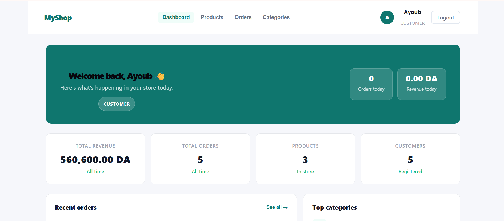
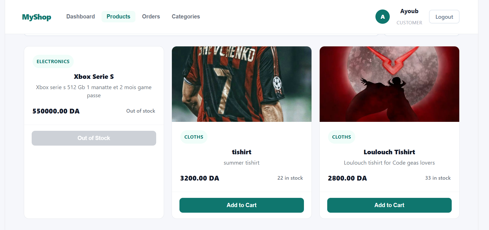
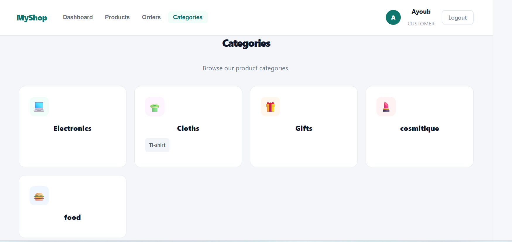
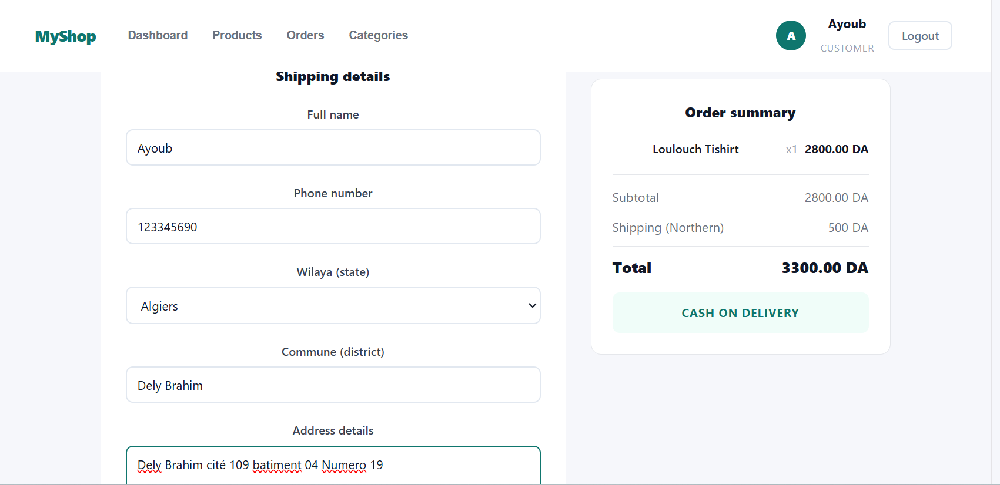
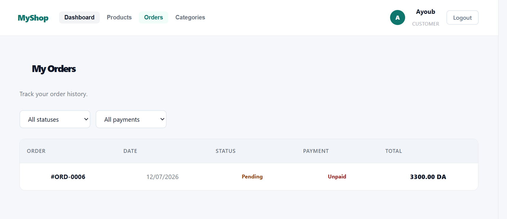
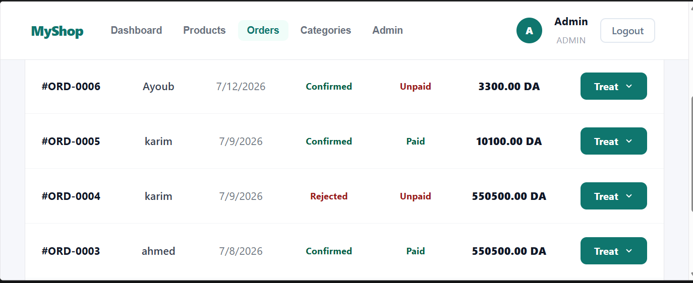
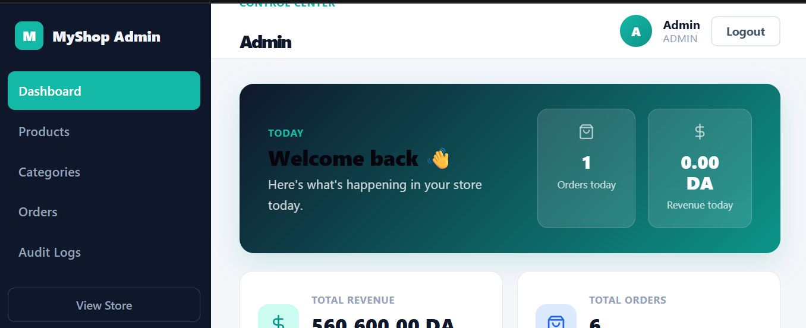
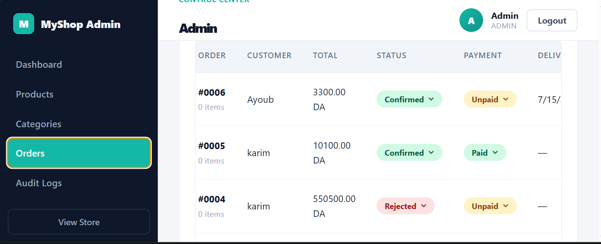
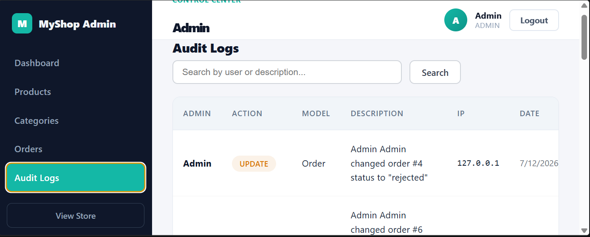

# 🛒 E-Commerce Platform

A modern full-stack e-commerce web application built with **Laravel 13** (API) and **React 19** (SPA). Features secure authentication, admin dashboard, product & category management, shopping cart, COD checkout with dynamic shipping, and audit logging.

## Tech Stack

| Layer      | Technology                                                               |
| ---------- | ------------------------------------------------------------------------ |
| **Frontend** | React 19, Vite 8, React Router 7, Axios                               |
| **Backend**  | Laravel 13, Sanctum (token auth), MySQL                                 |
| **Security** | Larastan (PHPStan level 5), ESLint + `eslint-plugin-security`, WAF middleware |
| **Tools**    | Composer, npm, SAST script (`sast.ps1`)                                |

## Features

- **Authentication** — Register / Login / Logout with Sanctum token auth
- **Role-based access** — Customer and Admin roles; admin panel protected by middleware
- **Products** — CRUD with image upload, categories, search, price filtering
- **Categories** — Nested categories (parent/children) with emoji mapping
- **Shopping Cart** — Add/remove items, quantity control, live shipping preview
- **Checkout (COD)** — Address form with all 58 Algerian wilayas, dynamic shipping cost
- **Orders** — Customer order history; Admin can confirm/reject, update status & payment
- **Audit Logs** — Every CRUD action on products, categories, orders, and auth events is logged
- **Dashboard** — Stats (revenue, orders, customers), recent orders, top categories chart
- **Responsive** — Hamburger mobile menu, adaptive layout down to 480px
- **WAF** — Web Application Firewall middleware protects API against SQLi and XSS

## Setup

### Prerequisites

- PHP ≥ 8.3, Composer
- Node.js ≥ 20, npm
- MySQL 8.0

### Backend

```bash
cd backend
cp .env.example .env        # configure DB credentials
composer install
php artisan key:generate
php artisan migrate --seed
php artisan serve            # http://127.0.0.1:8000
```

### Frontend

```bash
cd frontend
npm install
npm run dev                  # http://localhost:5173
```

### Default Credentials

| Role     | Email              | Password  |
| -------- | ------------------ | --------- |
| **Admin**  | admin@admin.com    | password  |
| **Customer** | (register via UI) |           |

## Running SAST Scans

```powershell
.\sast.ps1
```

Or individually:

```bash
# Backend (Larastan)
cd backend && composer phpstan

# Frontend (ESLint)
cd frontend && npm run lint
```

## Project Structure

```
├── backend/
│   ├── app/
│   │   ├── Http/Controllers/Api/   # API controllers
│   │   ├── Http/Middleware/         # WAF, IsAdmin
│   │   ├── Models/                  # Eloquent models
│   │   └── Services/                # AuditLogger, ShippingService
│   ├── config/                      # App configuration
│   ├── database/
│   │   ├── migrations/              # DB schema
│   │   └── seeders/                 # DatabaseSeeder
│   └── routes/api.php               # API routes
├── frontend/
│   ├── src/
│   │   ├── api/                     # Axios API client
│   │   ├── components/              # Toast, Skeleton
│   │   ├── context/                 # AuthContext
│   │   ├── pages/                   # All page components
│   │   │   └── admin/               # Admin dashboard, products, orders, audit logs
│   │   ├── styles/                  # CSS files
│   │   └── utils/                   # Errors, validation, shipping
│   └── eslint.config.js             # ESLint + security plugin
└── sast.ps1                         # Combined SAST runner
```
## Screenshots

##Home Page

##Product Page

##Category Page

##Order Pages


##Admin Pages





## API Endpoints

| Method | Endpoint                          | Auth     | Description              |
| ------ | --------------------------------- | -------- | ------------------------ |
| POST   | `/api/register`                   | Public   | Register a new user      |
| POST   | `/api/login`                      | Public   | Login                    |
| POST   | `/api/logout`                     | Sanctum  | Logout                   |
| GET    | `/api/me`                         | Sanctum  | Current user             |
| GET    | `/api/products`                   | Public   | List products            |
| GET    | `/api/products/{id}`              | Public   | Product details          |
| GET    | `/api/categories`                 | Public   | List categories          |
| GET    | `/api/categories/{id}`            | Public   | Category details         |
| POST   | `/api/orders`                     | Sanctum  | Place COD order          |
| GET    | `/api/orders`                     | Sanctum  | User's orders            |
| PATCH  | `/api/orders/{id}/status`         | Admin    | Update order status      |
| PATCH  | `/api/orders/{id}/payment`        | Admin    | Update payment status    |
| GET    | `/api/audit-logs`                 | Admin    | View audit logs          |
| GET    | `/api/dashboard/stats`            | Sanctum  | Dashboard statistics     |
| GET    | `/api/dashboard/orders`           | Sanctum  | Recent orders            |
| GET    | `/api/dashboard/categories`       | Sanctum  | Top categories           |
| POST   | `/api/products`                   | Admin    | Create product           |
| POST   | `/api/products/{id}`              | Admin    | Update product           |
| DELETE | `/api/products/{id}`              | Admin    | Delete product           |
| POST   | `/api/categories`                 | Admin    | Create category          |
| PUT    | `/api/categories/{id}`            | Admin    | Update category          |
| DELETE | `/api/categories/{id}`            | Admin    | Delete category          |


## Future Improvements

- Stripe payment integration
- Product reviews and ratings
- Wishlist feature
- Email notifications
- Multi-language support

## License

MIT
